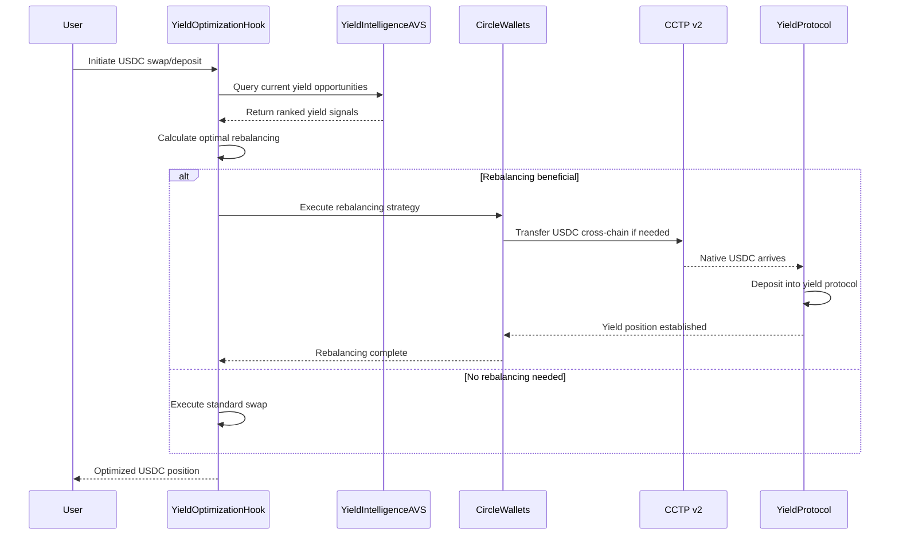

# AVS-Powered USDC Yield Hook

[](https://getfoundry.sh/)
[](https://github.com/Uniswap/v4-core)
[](https://eigenlayer.xyz/)
[](https://developers.circle.com/)
[](https://opensource.org/licenses/MIT)

[](https://soliditylang.org/)
[]()
[]()
[]()

[](https://eips.ethereum.org/EIPS/eip-4337)
[]()

## Overview

An intelligent Uniswap v4 Hook that leverages EigenLayer's Actively Validated Services (AVS) to monitor cross-protocol yield opportunities and automatically rebalances USDC positions using Circle's Wallets and CCTP v2. This system creates the first fully automated, institutionally-focused yield optimization protocol built natively into Uniswap v4.

**Sponsors:** EigenLayer (Benefactor) + Circle (Benefactor)  
**Prize Tier:** Combined Benefactor eligibility  
**Target Market:** Automated wealth management for USDC holders

## Problem Statement

Current DeFi yield strategies face critical inefficiencies:

1. **Manual Monitoring**: Users must constantly track yield opportunities across protocols
2. **Execution Delays**: By the time users identify opportunities, rates have changed
3. **Gas Inefficiency**: Multiple transactions required for rebalancing across protocols
4. **Information Asymmetry**: Institutional players have better access to yield data
5. **Cross-Chain Friction**: USDC yield varies significantly across chains but rebalancing is complex
6. **Security Concerns**: Users must trust multiple protocols and manage private keys

## Solution Architecture

### Core Innovation: AVS-Powered Yield Intelligence

Our system combines three cutting-edge technologies:
- **EigenLayer AVS**: Decentralized network monitoring yield opportunities with economic security
- **Circle Wallets**: Programmable, secure USDC custody with automated rebalancing
- **Uniswap v4 Hook**: Native integration into the most liquid DEX for seamless execution

### Technical Architecture

```
┌─────────────────────────────────────────────────────────────┐
│                    YIELD INTELLIGENCE AVS                    │
├─────────────────────────────────────────────────────────────┤
│  ┌─────────────────┐  ┌─────────────────┐  ┌──────────────┐ │
│  │  Protocol       │  │  Cross-Chain    │  │  Risk        │ │
│  │  Monitor        │  │  Rate Tracker   │  │  Assessment  │ │
│  │  Operators      │  │  Operators      │  │  Operators   │ │
│  └─────────────────┘  └─────────────────┘  └──────────────┘ │
└─────────────────────────────────────────────────────────────┘
                              ↓
┌─────────────────────────────────────────────────────────────┐
│                    UNISWAP V4 HOOK                         │
├─────────────────────────────────────────────────────────────┤
│  • Receives AVS yield signals                              │
│  • Triggers automated rebalancing                          │
│  • Optimizes swap routes for efficiency                    │
│  • Manages user USDC positions                            │
└─────────────────────────────────────────────────────────────┘
                              ↓
┌─────────────────────────────────────────────────────────────┐
│                    CIRCLE INTEGRATION                       │
├─────────────────────────────────────────────────────────────┤
│  ┌─────────────────┐  ┌─────────────────┐  ┌──────────────┐ │
│  │  Programmable   │  │  CCTP v2        │  │  Paymaster   │ │
│  │  Wallets        │  │  Cross-Chain    │  │  USDC Gas    │ │
│  │  Auto Execute   │  │  Native USDC    │  │  Payments    │ │
│  └─────────────────┘  └─────────────────┘  └──────────────┘ │
└─────────────────────────────────────────────────────────────┘
```

## Key Components

### 1. Yield Intelligence AVS

**Purpose**: A decentralized network of operators continuously monitoring DeFi yield opportunities.

**Operator Tasks (Offchain Software)**:
- **Protocol Monitoring**: Go/Rust clients query yield rates across lending protocols (Aave, Compound, Morpho)
- **Cross-Chain Analysis**: Multi-chain RPC clients compare USDC yields across Ethereum, Base, Arbitrum, Polygon
- **Risk Assessment**: Analyze protocol TVL, smart contract risk scores, and historical performance data
- **Data Attestation**: Sign yield opportunity data with ECDSA keys before submitting to onchain contracts
- **Continuous Operation**: 24/7 monitoring with configurable update intervals and error handling

**Economic Security**:
- Operators stake ETH through EigenLayer restaking
- Slashing conditions for providing false or stale yield data
- Reward distribution based on signal accuracy and timeliness

### 2. Smart Rebalancing Hook

**Hook Integration**:
```solidity
contract YieldOptimizationHook is BaseHook {
    using YieldIntelligenceAVS for YieldData;
    using CircleWalletManager for USDCPosition;
    
    function beforeSwap(
        address sender,
        PoolKey calldata key,
        IPoolManager.SwapParams calldata params,
        bytes calldata hookData
    ) external override returns (bytes4) {
        if (_isUSDCPool(key) && _shouldRebalance(sender)) {
            return _executeYieldOptimization(sender, params);
        }
        return BaseHook.beforeSwap.selector;
    }
}
```

**Rebalancing Logic**:
1. Query AVS for current best yield opportunities
2. Calculate optimal allocation across protocols and chains
3. Execute rebalancing via Circle Wallets if net benefit exceeds threshold
4. Update user position tracking and analytics

### 3. Circle Wallets Integration

**Programmable Custody**:
- **Developer-Controlled Wallets**: Automated execution based on yield signals
- **User-Controlled Wallets**: Users maintain control, approve rebalancing strategies
- **Multi-Chain Support**: Single wallet interface across all supported chains

**CCTP v2 Benefits**:
- **Native USDC Transfers**: No wrapped tokens, maintain USDC fungibility
- **Fast Finality**: Faster-than-finality transfers with instant attestation
- **Composable Hooks**: Trigger actions automatically after cross-chain transfers

**Paymaster Integration**:
- **USDC Gas Payments**: Users never need native tokens for gas
- **Cross-Chain Gas**: USDC on one chain pays gas on another
- **Account Abstraction**: ERC-4337 compatible smart contract accounts

## Business Model & Market Opportunity

### Target Market Segments

**1. Retail DeFi Users ($500M+ TAM)**
- **Pain Point**: Manual yield farming requires constant attention
- **Solution**: Set-and-forget USDC yield optimization
- **Value Prop**: Higher returns with lower effort

**2. Institutional Treasuries ($50B+ TAM)**
- **Pain Point**: Need predictable, secure yield on USDC reserves
- **Solution**: Automated rebalancing with institutional-grade security
- **Value Prop**: Enhanced returns with risk management and compliance features

**3. DeFi Protocols ($10B+ TAM)**
- **Pain Point**: Idle treasury assets earning minimal yield
- **Solution**: Plug-and-play treasury management integration
- **Value Prop**: Revenue generation from idle assets

### Revenue Streams

1. **Management Fees**: 0.5-1% annually on assets under management
2. **Performance Fees**: 10-20% of excess returns generated
3. **AVS Operator Rewards**: Revenue sharing from EigenLayer operator network
4. **Premium Features**: Advanced analytics and custom strategies for institutions

### Competitive Advantages

1. **First-Mover**: Novel combination of AVS intelligence + automated execution
2. **Technical Moats**: Deep Uniswap v4 integration and proprietary yield algorithms
3. **Network Effects**: More AVS operators = better yield intelligence = more users
4. **Regulatory Compliance**: Circle's regulated infrastructure provides institutional comfort

## Technical Implementation

### AVS Architecture

**Onchain Components (Solidity)**:
```solidity
contract YieldIntelligenceServiceManager is ServiceManagerBase {
    struct YieldOpportunity {
        address protocol;
        uint256 chain;
        uint256 apy;
        uint256 tvl;
        uint256 riskScore;
        uint256 timestamp;
        bytes32 attestation;
    }
    
    mapping(address => YieldOpportunity[]) public operatorSignals;
    uint256 public constant SIGNAL_VALIDITY_PERIOD = 300; // 5 minutes
    
    function submitYieldData(
        YieldOpportunity[] calldata opportunities
    ) external onlyOperator {
        // Validate signatures and store yield data
        // Emit signals for hook consumption
    }
}
```

**Offchain Operator Software (Go/Rust)**:
```go
// AVS Operator Node - Go implementation
type YieldOperator struct {
    eigenlayerClient *eigenlayer.Client
    protocolClients  map[string]ProtocolClient
    rpcClients       map[uint64]*ethclient.Client
    signingKey       *ecdsa.PrivateKey
}

func (op *YieldOperator) MonitorYieldOpportunities() {
    ticker := time.NewTicker(30 * time.Second)
    for range ticker.C {
        opportunities := op.scanAllProtocols()
        signedData := op.signYieldData(opportunities)
        op.submitToContract(signedData)
    }
}

func (op *YieldOperator) scanAllProtocols() []YieldOpportunity {
    var opportunities []YieldOpportunity
    
    // Query Aave across all chains
    aaveRates := op.queryAaveRates()
    opportunities = append(opportunities, aaveRates...)
    
    // Query Compound
    compoundRates := op.queryCompoundRates()
    opportunities = append(opportunities, compoundRates...)
    
    // Add risk scoring
    for i := range opportunities {
        opportunities[i].RiskScore = op.calculateRiskScore(opportunities[i])
    }
    
    return opportunities
}
```
```

### Circle Wallet Manager

```solidity
contract CircleWalletManager {
    using CircleWallets for address;
    using CCTP for USDCTransfer;
    
    struct YieldStrategy {
        uint256 targetAllocation;
        uint256 rebalanceThreshold;
        bool autoRebalance;
        address[] approvedProtocols;
    }
    
    function executeRebalancing(
        address user,
        YieldOpportunity[] calldata opportunities
    ) external onlyHook {
        YieldStrategy storage strategy = userStrategies[user];
        
        // Calculate optimal allocation
        AllocationPlan memory plan = _optimizeAllocation(
            strategy,
            opportunities
        );
        
        // Execute via Circle Wallets
        _executeWithCircleWallets(user, plan);
    }
}
```

### Cross-Chain Execution Flow



## Supported Protocols & Chains

### Initial Yield Protocols
- **Aave V3**: Multi-chain lending with variable rates
- **Compound V3**: High-efficiency USDC lending
- **Morpho**: Optimized lending with peer-to-peer matching
- **Maker DSR**: Ethereum's savings rate for USDC conversion

### Supported Chains
- **Ethereum**: High security, established protocols
- **Base**: Low fees, growing DeFi ecosystem
- **Arbitrum**: Layer 2 efficiency with full protocol support
- **Polygon**: Ultra-low fees for small position management
- **Avalanche**: High-performance execution environment

### Expansion Roadmap
- **Optimism**: Additional L2 coverage
- **Solana**: Via Circle's CCTP expansion
- **Additional Protocols**: Yearn, Convex, Frax Finance

## Development Roadmap

### Phase 1: Core Infrastructure (Weeks 1-4)
- [ ] Basic AVS operator framework
- [ ] Yield data aggregation system  
- [ ] Uniswap v4 hook integration
- [ ] Circle Wallets integration
- [ ] Single-chain rebalancing logic

### Phase 2: Cross-Chain Optimization (Weeks 5-8)
- [ ] CCTP v2 integration for native USDC transfers
- [ ] Multi-chain yield opportunity analysis
- [ ] Cross-chain rebalancing execution
- [ ] Paymaster integration for gas abstraction
- [ ] Risk management framework

### Phase 3: Advanced Features (Weeks 9-12)
- [ ] Machine learning yield prediction models
- [ ] MEV protection mechanisms
- [ ] Institutional compliance features
- [ ] Advanced analytics dashboard
- [ ] Mobile wallet integration

### Phase 4: Production & Scale (Weeks 13-16)
- [ ] Mainnet deployment and testing
- [ ] Audit completion and security review
- [ ] Operator network bootstrapping
- [ ] Partnership integrations
- [ ] Community governance launch

## Risk Management

### Technical Risks
- **AVS Operator Failures**: Mitigated through EigenLayer slashing and redundant operators
- **Smart Contract Risks**: Comprehensive testing and formal verification
- **Oracle Failures**: Multiple data sources and validity checks

### Financial Risks
- **Yield Volatility**: Conservative rebalancing thresholds and stop-loss mechanisms
- **Protocol Risks**: Diversification across multiple audited protocols
- **Liquidity Risks**: Real-time monitoring of protocol TVL and withdrawal capacity

### Operational Risks
- **Key Management**: Hardware security modules and multi-sig governance
- **Regulatory Compliance**: Partnership with Circle ensures regulatory alignment
- **Scalability**: Modular architecture supports horizontal scaling

## Success Metrics

### Technical KPIs
- **AVS Accuracy**: >95% accuracy in yield opportunity identification
- **Execution Speed**: <5 minute average rebalancing time
- **Gas Efficiency**: 50%+ reduction in gas costs vs manual rebalancing
- **Uptime**: >99.9% system availability

### Business KPIs
- **Assets Under Management**: Target $100M+ within 12 months
- **User Acquisition**: 10,000+ active users in first year
- **Yield Enhancement**: 200+ basis points improvement over manual strategies
- **Revenue Growth**: $1M+ annual recurring revenue

### User Experience KPIs
- **Time to Value**: <5 minutes from signup to first yield optimization
- **User Retention**: 80%+ monthly active user retention
- **Customer Satisfaction**: >4.5/5 user rating
- **Support Efficiency**: <24 hour average support response time

## Competitive Analysis

### vs Traditional Yield Farms
- **Advantage**: Automated monitoring and rebalancing vs manual management
- **Advantage**: Cross-protocol optimization vs single protocol focus
- **Advantage**: Institutional-grade security vs individual custody risks

### vs Yield Aggregators (Yearn, Beefy)
- **Advantage**: Real-time AVS intelligence vs periodic rebalancing
- **Advantage**: Native Uniswap integration vs external vault systems
- **Advantage**: Cross-chain native USDC vs wrapped token complexities

### vs Traditional Finance
- **Advantage**: 24/7 automated execution vs business hours limitations
- **Advantage**: Transparent on-chain operations vs black box strategies
- **Advantage**: Programmable money vs manual processes

## Project Structure

```
avs-powered-usdc-yield/
├── src/
│   ├── hooks/
│   │   ├── YieldOptimizationHook.sol        # Main Uniswap v4 hook
│   │   └── interfaces/
│   │       ├── IYieldIntelligenceAVS.sol    # AVS interface
│   │       └── ICircleWalletManager.sol     # Circle integration interface
│   │
│   ├── avs/
│   │   ├── YieldIntelligenceServiceManager.sol  # AVS service manager (onchain)
│   │   ├── YieldOperatorRegistry.sol            # Operator registration (onchain)
│   │   └── slashing/
│   │       ├── SlashingConditions.sol           # Define slashing rules
│   │       └── DisputeResolution.sol            # Handle operator disputes
│   │
│   ├── circle/
│   │   ├── CircleWalletManager.sol          # Wallet interaction logic
│   │   ├── CCTPIntegration.sol             # Cross-chain USDC transfers
│   │   ├── PaymasterIntegration.sol        # ERC-4337 gas abstraction
│   │   └── USDCYieldStrategy.sol           # Rebalancing execution logic
│   │
│   ├── protocols/
│   │   ├── AaveV3Adapter.sol               # Aave lending integration
│   │   ├── CompoundAdapter.sol             # Compound protocol integration
│   │   ├── MorphoAdapter.sol               # Morpho optimization layer
│   │   └── BaseYieldAdapter.sol            # Abstract adapter interface
│   │
│   ├── libraries/
│   │   ├── YieldCalculations.sol           # APY calculations and comparisons
│   │   ├── RiskAssessment.sol              # Protocol risk scoring
│   │   ├── AllocationOptimizer.sol         # Portfolio optimization algorithms
│   │   └── CrossChainUtils.sol             # Multi-chain operation utilities
│   │
│   ├── oracles/
│   │   ├── YieldDataOracle.sol             # Aggregated yield data feed
│   │   ├── RiskOracle.sol                  # Risk metric aggregation
│   │   └── ChainlinkPriceFeeds.sol         # External price data
│   │
│   └── governance/
│       ├── YieldGovernance.sol             # Protocol governance
│       ├── OperatorGovernance.sol          # AVS operator governance
│       └── EmergencyPause.sol              # Emergency stop mechanisms
│
├── operator/                               # AVS Operator Software (Go/Rust)
│   ├── cmd/
│   │   ├── operator/                       # Main operator binary
│   │   │   └── main.go                     # Operator entry point
│   │   └── keygen/                         # Key generation utility
│   │       └── main.go                     # ECDSA key generation
│   │
│   ├── pkg/
│   │   ├── avs/
│   │   │   ├── client.go                   # EigenLayer AVS client
│   │   │   ├── registration.go             # Operator registration logic
│   │   │   └── submission.go               # Data submission to contracts
│   │   │
│   │   ├── protocols/
│   │   │   ├── aave/                       # Aave protocol client
│   │   │   │   ├── client.go               # Aave rate querying
│   │   │   │   └── types.go                # Aave data structures
│   │   │   ├── compound/                   # Compound protocol client
│   │   │   │   ├── client.go               # Compound rate querying
│   │   │   │   └── types.go                # Compound data structures
│   │   │   └── interfaces.go               # Protocol client interfaces
│   │   │
│   │   ├── monitoring/
│   │   │   ├── yield_scanner.go            # Main yield opportunity scanner
│   │   │   ├── risk_assessor.go            # Protocol risk analysis
│   │   │   └── data_aggregator.go          # Multi-source data aggregation
│   │   │
│   │   ├── crypto/
│   │   │   ├── signer.go                   # ECDSA signing utilities
│   │   │   └── attestation.go              # Data attestation logic
│   │   │
│   │   └── config/
│   │       ├── config.go                   # Configuration management
│   │       └── chains.go                   # Multi-chain RPC configuration
│   │
│   ├── docker/
│   │   ├── Dockerfile                      # Operator container image
│   │   └── docker-compose.yml              # Local development stack
│   │
│   ├── scripts/
│   │   ├── build.sh                        # Build automation
│   │   ├── deploy.sh                       # Deployment automation
│   │   └── register-operator.sh            # Operator registration script
│   │
│   ├── configs/
│   │   ├── operator-config.yaml            # Operator configuration
│   │   ├── chains.yaml                     # Chain-specific settings
│   │   └── protocols.yaml                  # Protocol endpoints and settings
│   │
│   └── go.mod                              # Go module definition
│
├── test/
│   ├── unit/
│   │   ├── YieldOptimizationHook.t.sol     # Hook unit tests
│   │   ├── ServiceManager.t.sol            # AVS service manager tests
│   │   └── CircleIntegration.t.sol         # Circle integration tests
│   │
│   ├── integration/
│   │   ├── EndToEndYield.t.sol             # Full yield optimization flow
│   │   ├── CrossChainRebalancing.t.sol     # Multi-chain operations
│   │   └── AVSDataFlow.t.sol               # Onchain AVS data submission tests
│   │
│   ├── fork/
│   │   ├── MainnetYieldTests.t.sol         # Live protocol testing
│   │   ├── ArbitrumYieldTests.t.sol        # Layer 2 protocol testing
│   │   └── BaseYieldTests.t.sol            # Base chain protocol testing
│   │
│   └── mocks/
│       ├── MockYieldProtocols.sol          # Protocol mocks for testing
│       ├── MockAVSServiceManager.sol       # AVS service manager mock
│       └── MockCircleServices.sol          # Circle service mocks
│
├── operator/                               # AVS Operator Tests (Go)
│   ├── tests/
│   │   ├── unit/
│   │   │   ├── yield_scanner_test.go       # Unit tests for yield scanning
│   │   │   ├── risk_assessor_test.go       # Risk assessment logic tests
│   │   │   └── protocol_clients_test.go    # Protocol client tests
│   │   │
│   │   ├── integration/
│   │   │   ├── operator_flow_test.go       # End-to-end operator tests
│   │   │   └── contract_interaction_test.go # Onchain interaction tests
│   │   │
│   │   └── mocks/
│   │       ├── mock_protocols.go           # Mock protocol responses
│   │       └── mock_eigenlayer.go          # Mock EigenLayer client
│
├── script/
│   ├── Deploy.s.sol                        # Main deployment script
│   ├── SetupAVS.s.sol                      # AVS operator registration
│   ├── ConfigureProtocols.s.sol            # Yield protocol setup
│   └── InitializeStrategies.s.sol          # Default strategy configuration
│
├── docs/
│   ├── AVS_OPERATORS.md                    # Operator onboarding guide
│   ├── YIELD_STRATEGIES.md                 # Strategy configuration docs
│   ├── CIRCLE_INTEGRATION.md               # Circle services integration
│   └── API_REFERENCE.md                    # Technical API documentation
│
└── frontend/                               # Optional dashboard interface
    ├── dashboard/                          # Yield analytics dashboard
    ├── operator-portal/                    # AVS operator interface
    └── user-interface/                     # End-user yield management
```

## Getting Started

### Prerequisites
- **Foundry** (latest version)
- **Node.js** 18+ for frontend components
- **EigenLayer Testnet Access** for AVS development
- **Circle Developer Account** for Wallets and CCTP integration

### Installation
```bash
# Clone repository
git clone https://github.com/your-org/avs-powered-usdc-yield
cd avs-powered-usdc-yield

# Install contract dependencies
cd contracts/
forge install

# Set up environment variables
cp ../.env.example ../.env
# Configure RPC URLs, private keys, and API keys

# Build contracts
forge build

# Run contract tests
forge test

# Build AVS operator software
cd ../avs/
go mod download
go build -o bin/operator cmd/operator/main.go

# Run Go tests
go test ./...
```

### AVS Operator Setup
```bash
# Build operator software
cd avs/
go mod download
go build -o bin/operator cmd/operator/main.go

# Generate operator keys
./bin/operator keygen --output keys/operator.key

# Configure operator
cp configs/operator-config.example.yaml configs/operator-config.yaml
# Edit configuration with your RPC endpoints and keys

# Register as AVS operator (onchain)
cd ../contracts/
forge script script/SetupAVS.s.sol --rpc-url $HOLESKY_RPC_URL --broadcast

# Start operator node (offchain)
cd ../avs/
./bin/operator start --config configs/operator-config.yaml
```

### Circle Integration Setup
```bash
# Configure Circle developer account
export CIRCLE_API_KEY="your-api-key"
export CIRCLE_ENTITY_SECRET="your-entity-secret"

# Deploy Circle Wallet contracts
cd contracts/
forge script script/DeployCircleIntegration.s.sol --broadcast

# Test CCTP integration
forge test --match-contract CCTPIntegration --fork-url $MAINNET_RPC_URL
```

## Contributing

We welcome contributions from the community! Please see our [Contributing Guide](CONTRIBUTING.md) for:
- Development workflow
- Code style guidelines
- Testing requirements
- Pull request process

### For AVS Operators
If you're interested in becoming a yield intelligence operator:
1. Review our [AVS Operators Guide](docs/AVS_OPERATORS.md)
2. Join our [Discord community](#contact)
3. Participate in testnet operations
4. Apply for mainnet operator status

### For Protocol Partners
We're actively seeking partnerships with additional yield protocols:
1. Review our [Protocol Integration Guide](docs/PROTOCOL_INTEGRATION.md)
2. Implement the `BaseYieldAdapter` interface
3. Submit integration proposal via GitHub issues

## Security & Audits

- **Smart Contract Audits**: Planned with top-tier firms (Trail of Bits, Consensys Diligence)
- **AVS Security Review**: EigenLayer security assessment and operator slashing validation
- **Circle Integration Review**: Circle security team validation of wallet and CCTP integration
- **Bug Bounty Program**: $100K+ reward pool for critical vulnerability discovery

## License

MIT License - see [LICENSE](LICENSE) for details.

## Contact

- **Team**: AVS Yield Labs
- **Discord**: [Join our community](https://discord.gg/your-server)
- **Twitter**: [@AVSYieldLabs](https://twitter.com/your-handle)
- **Email**: team@avsyield.com
- **Operator Support**: operators@avsyield.com

## Acknowledgments

Special thanks to:
- **EigenLayer Team** for pioneering restaking and AVS infrastructure
- **Circle Team** for building the future of programmable money
- **Uniswap Team** for creating the most advanced DEX architecture
- **UHI5 Organizers** for fostering innovation in DeFi

---

*This project is submitted for the Uniswap v4 Hookathon (UHI5), targeting EigenLayer (Benefactor) and Circle (Benefactor) sponsor prizes. Building the future of automated wealth management with restaked security and programmable money.*
